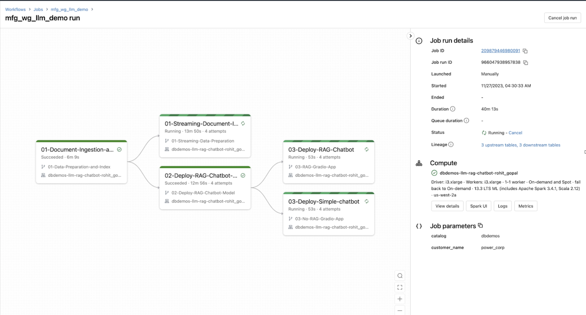

# Industry RAG (Retrieval Augmented Generation) Demo with PDF Documents | Databricks Apps
Retrieval Augemented Generation (RAG from here on) is a technique that allows large language models to be custom-tailored to an organization's key documents, files, data, and information. RAG is intuitive to leverage on Databricks with MLFlow model management and serving, Unity Catalog for pipeline tracking, and more.

RAG has applications across industries, including use-cases such as:

- Healthcare and Life Sciences: Accurate and up-to-date patient recommendation systems.
- Financial Services: Improve access to legalese / legal stuff (to change these).
- Retail and Customer Goods: Optimization of product recommendation systems based on catalog ingestion. 

In this project, we demonstrate how RAG works on Databricks today, as well as how end-users can leverage Databricks Apps to provide a sleek frontend to such a complex process. More specifically, this demo provides:

- Notebooks that provision:
    - Databricks streaming jobs for document ingestion.
    - Databricks ML endpoints for LLM querying.
    - _and more!_
- Databricks App built with Gradio
    - This application allows end-users to upload their own PDF document to Databricks.

# Instructions

1. TODO -- add how we're going to distribute this (dbdemos, or just git repository clone into a DBX area)
2. Cal needs to further edit the below from Andrew's original so that it's everyone-facing. 

1. Generate a job / workflow by running 0Z_workflow_creation.py. The job name will be `(your_name) mfg_llm_demo`
Run the job. If the job runs successfully, it will continue to run tasks `01-Streaming-Document-Ingestion`, `03-Deploy-RAG-Chatbot` and `03-Deploy-Simple-chatbot` perpetually since those tasks are meant to run for the duration of your demo.
    - Task `01-Streaming-Document-Ingestion` continuously ingests PDF documents from the Volume and loads them into the Vector Search index
    - Tasks `03-Deploy-RAG-Chatbot` and `03-Deploy-Simple-chatbot` host the Gradio app locally in the interactive cluster using a driver proxy. This allows us to avoid posting the gradio app publicly on HuggingFace, which is risky with sensitive data.

2. By default this job automatically ingests a default document that you can change as a parameter in the workflow. You can add your customer specific PDF documents to `{catalog}.{database}.{Volume}` path as defined by the parameters you input in the job. You can do this step of providing the PDF beforehand or live, during the demo! If done live, you might need to wait for 30+ seconds to let it process the PDF and upload to vector index.
    - For the exact catalog and database, please check the output of the cell which executes `%run ./_resources/00-init` at the top of any of the notebooks.
3. Tasks `03-Deploy-RAG-Chatbot` and `03-Deploy-Simple-chatbot` will print out the URLs to the respective RAG and Non-RAG / Simple chatbot gradio applications at the last but one cell in the notebook.
    - Search for keywords "Use this URL to access the chatbot app:"
    - Click on those URLs to open the RAG chatbot titled 'Chatbot powered by Databricks' and Non-RAG chatbot titled 'Simple Chatbot'
4. Enter the same business specific question in both the chatbots to highlight the power of customizing the LLM with your customer's enterprise data.
    - The RAG chatbot should return an accurate answer based on the PDF docs dropped into the Volume
    - The Non-RAG chatbot will likely return a hallucinated answer since it has no access to customer specific documents or data.
    - For example, try the question "How can I make my data ingestion API efficient? Explain in bullet points." based on the Fivetran documentation. First check the PDF document yourself and then look at the responses by the two chatbots. You should see the RAG chatbot returning an accurate answer.
    - We recommend using PDFs related to your customer and tweaking the corresponding questions to make a compelling demo. 

## Credits
This demo is a collaboration between the talented:

- Andrew Kraemer, Solutions Architect
- Rohit Gopal, Lead Specialist Solutions Architect
- Will Block, Solutions Architect

And the dbdemos team at Databricks:

- Quentin Ambard, Chief Demo Officer
- Cal Reynolds, Industry Solutions Architect